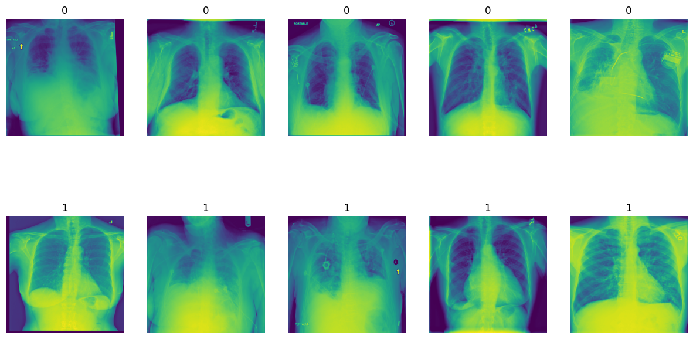
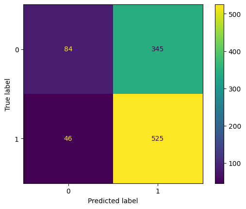
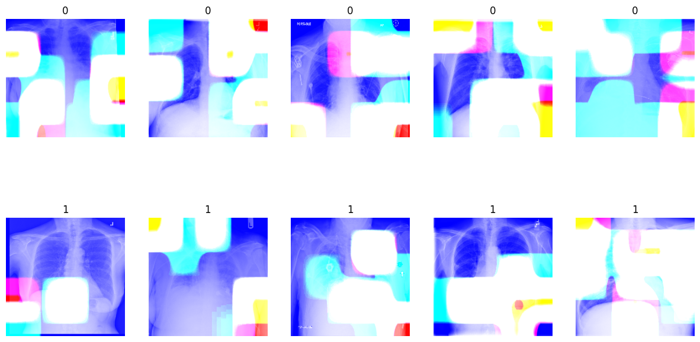

# Chest X-ray Image Classification Project

## Problem Statement
The goal of this project is to differentiate normal and abnormal chest X-ray images with high sensitivity. The dataset comprises various diseases, and the objective is to classify them into a binary task: '0' for normal and '1' for abnormal X-rays.

## Proposed Solution
To achieve this, we developed a Convolutional Neural Network (CNN) capable of detecting abnormalities in X-ray images with high accuracy. We utilized CNN architectures such as VGG16, ResNet50, and InceptionV3 for feature extraction. The models were trained on 5000 images and evaluated on an additional 1000 images.

## Training Models
- ResNet50 outperformed VGG16 and InceptionV3.
- Augmentation did not significantly improve model performance.
- Experimented with different optimization techniques and loss functions for better results.

| Models (12 Models)       | Accuracy | Recall | Precision |
|--------------------------|----------|--------|-----------|
| val_accuracy Inc. With AUg | 0.458    | 0.269  | 0.727     |
| val_accuracy Inc. WithOut AUg | 0.446  | 0.223  | 0.752     |
| val_accuracy ResNet With AUg | 0.608   | 0.674  | 0.709     |
| val_accuracy ResNet WithOut AUg | 0.643| 0.822  | 0.690     |
| val_accuracy VGG With AUg | 0.638      | 0.770  | 0.713 |
| val_accuracy VGG WithOut AUg | 0.618   | 0.850  | 0.645     |
| val_recall Inc. With AUg | 0.501          | 0.352  | 0.751     |
| val_recall Inc. WithOut AUg | 0.626      | 0.794  | 0.683     |
| val_recall ResNet With AUg | 0.598        | 0.540  | 0.775     |
| val_recall ResNet WithOut AUg | 0.528     | 0.389  | 0.774     |
| val_recall VGG With AUg | 0.414           | 0.153  | 0.746     |
| val_recall VGG WithOut AUg | 0.345        | Error  | Error     |

## Model's Summary Tricks
- Implemented a trick by changing the optimizer to 'adamax' and using Binary Cross Entropy as the loss function.
- Also by, instead of using threshold of 0.5 , we are going to use threshold of 0.3 to classify with high recall score.
- Despite a promising recall score, initial model performance had room for improvement.

## Final Results
- Achieved high sensitivity in detecting abnormal X-ray images.
- Utilized Grad-CAMs to visualize important regions in images for classification.
- The model focuses on specific features crucial for accurate classification of lung diseases.

## Grad-CAMs
- Gradient-weighted Class Activation Mapping (Grad-CAM) used to understand important regions in images.
- White areas in Grad-CAMs indicate where the model focuses its attention for predictions.
- Changes in these regions impact the model's ability to classify different lung diseases accurately.

#### Usage

To replicate the results or explore the code further, follow these steps:

1. Clone the repository to your local machine.
2. Ensure you have all the dependencies installed. Check `requirements.txt` for details.
3. Open `main-file.ipynb` using Jupyter Notebook or any compatible environment.
4. Follow the instructions and run the code cells to analyze the dataset, train the model, and evaluate the results.

#### License

This project is licensed under the terms of the MIT License. Feel free to use the code and resources for educational purposes or to build upon them for your own projects.

#### Contact

For any inquiries or feedback, feel free to contact the author:

- **Author:** Luficer G
- **Email:** luficergfree@gmail.com

---
  
Start exploring and learning from this project today! If you find it useful, don't forget to give it a star ⭐️. Thank you for your interest!